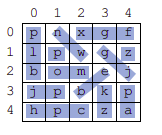

# Prva naloga

Podana je mreža črk in seznam besed. Vsaka beseda iz seznama je vpisana v mrežo v eni izmed osmih
smeri: vodoravno, navpično in diagonalno, naprej in nazaj. Naloga je poiskati vse besede iz seznama
tako, da posamezna črka v mreži pripada samo eni besedi.
Implementirajte razred **Naloga1**, ki vsebuje metodo **main**. Metoda v argumentih prejme poti do
vhodne in izhodne datoteke (args[0] in args[1]). Metoda naj prebere vhodne podatke, poišče besede
v mreži in v izhodno datoteko zapiše njihove pozicije.
Tekstovna vhodna datoteka je podana v naslednjem formatu:
V prvi vrstici sta zapisani dve celi števili, ločeni z vejico. Zapis V,S določa dimenzije mreže, pri
čemer je V število vrstic in S število stolpcev mreže.
* V naslednjih V vrsticah so zapisani elementi mreže. Vsaka vrstica vsebuje S znakov, ločenih z
vejicami.
* V naslednji vrstici je celo število B. Ta predstavlja število besed, ki jih iščemo v mreži.
* V vsaki izmed naslednjih B vrstic je zapisana ena beseda.

Tekstovna izhodna datoteka naj vsebuje B vrstic. V vsaki vrstici naj bo najprej zapisana beseda, nato
še štiri cela števila, ločena z vejico. Prvi par števil V1,S1 določa pozicijo prve črke besede v mreži,
drugi par V2,S2 pa pozicijo zadnje črke besede v mreži. **Pozor: indeksiranje začne z 0.**

Pri tej nalogi je možnih več enakovrednih rešitev.

| Vhodna datoteka:      | Izhodna datoteka:      |
|------------|-------------|
|5,5 p,n,x,g,f l,p,w,g,z b,o,m,e,j j,p,b,k,p h,p,c,z,a 12xgf mo zk jp plb nw hpc p pa z jg be | xgf,0,2,0,4mo,2,2,2,1 zk,4,3,3,3 jp,3,0,3,1 plb,0,0,2,0 nw,0,1,1,2 hpc,4,0,4,2 p,1,1,1,1 pa,3,4,4,4 z,1,4,1,4 jg,2,4,1,3 be,3,2,2,3 

Razlaga primera:

