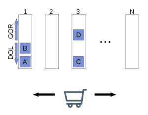
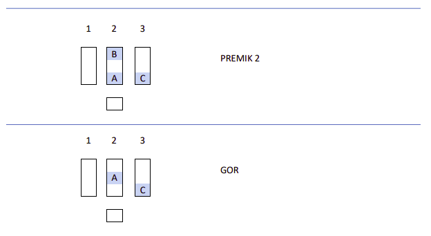
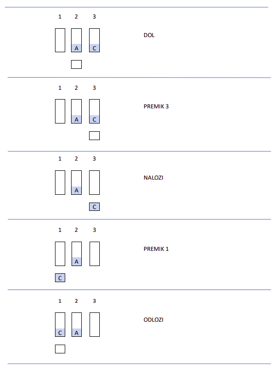

## Peta naloga
###### nenarejeno

Na spodnji sliki je prikazan načrt skladišča.

Imamo N odstavnih trakov, na vsak trak lahko shranimo **P** enako velikih predmetov. Skladišče
upravljamo z robotskim vozičkom, s katerim lahko dostopamo le do prvega predmeta na
posameznem traku. Trak se torej obnaša po LIFO principu: v primeru traku 1 lahko v tem trenutku
dostopamo le do elementa A, do B ne moremo priti. Med predmeti imamo lahko tudi prazen prostor,
kot je to v primeru tretjega traku.

Skladišče upravljamo z naslednjimi ukazi:

1) PREMIK i; premakne voziček do i-tega traku (1 ≤ i ≤ N).

2) NALOZI; naložimo trenutni zaboj iz sklada na voziček. Če voziček ni prazen, se ne zgodi nič.

3) ODLOZI; odložimo zaboj iz vozička na trenutni trak. Če na traku ni prostora, zaboj ostane na
vozičku.

4) GOR; trenutni trak (kjer je voziček) premakne vse zaboje za en korak gor (glej sliko). Zaboj, ki
je pred to akcijo na zadnjem mestu, pade iz traku in izgine. Npr., če bi 2x izvedli ukaz GOR na
traku 3, bi s tem izgubili zaboj D.

5) DOL; trak se premakne dol. Zaboj na prvem mestu se, tako kot zadnji zaboj pri GOR, uniči.

Napišite program, ki sprejme začetno in končno konfiguracijo skladišča ter poišče **najkrajše
zaporedje** ukazov, ki vodijo od začetne do končne konfiguracije. Robotski voziček naj **vedno začne na
lokaciji 1**. Lahko predpostavite, da bo vedno možno doseči končno ureditev.

Implementirajte razred **Naloga5**, ki vsebuje metodo **main**. Metoda v argumentih prejme poti do
vhodne in izhodne datoteke (args[0] in args[1]). Metoda naj prebere vhodne podatke, poišče
najkrajše zaporedje ukazov, ki rešijo nalogo, in jih zapiše v izhodno datoteko.

 

Tekstovna vhodna datoteka je podana v naslednjem formatu:

- V prvi vrstici bosta podana število trakov (N ≤ 5) in dolžina trakov (P ≤ 5).

- V naslednjih N vrsticah je opisana vsebina posameznih trakov začetne konfiguracije. Vsaka
vrstica se začne s številko traku, za njo pride dvopičje, sledijo oznake zabojev ločene z vejico.
Zaboji so označeni z eno črko ('A' do 'Z').

- V naslednjih N vrsticah je opisana vsebina posameznih trakov končne konfiguracije.

 

Tekstovna izhodna datoteka naj vsebuje najkrajše zaporedje ukazov, ki dosežejo zahtevano ureditev.
Vsak ukaz naj bo v svoji vrstici. Pri tej nalogi je možnih več enakovrednih rešitev.

 

Primer:

| Vhodna datoteka:      | Izhodna datoteka:      |
|------------|-------------|
|3,3 1: 2:A,,B 3:C 1:C 2:A 3:|PREMIK 2 GOR DOL PREMIK 3 NALOZI PREMIK 1 ODLOZI|

 

Razlaga primera:

